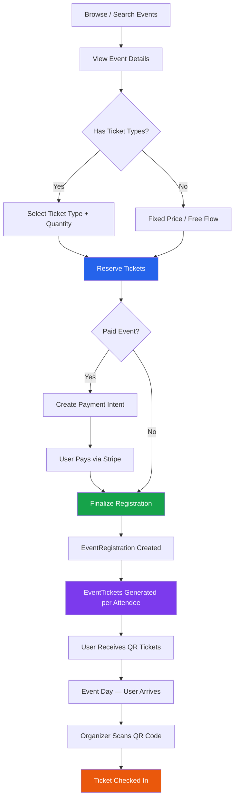

# Event Registration — Complete User Flow

End-to-end journey from discovering an event to attending it.

---

## Flow Overview

```
Browse Events → View Event → Reserve Tickets → Pay (if paid) → Finalize Registration
   → Tickets Issued (QR) → Event Day → Check-In via QR Scan
```



---

## Data Models Involved

| Model | Purpose |
|-------|---------|
| `Event` | The event itself (title, date, capacity, price) |
| `EventTicketType` | Ticket tiers (VIP, General, etc.) with capacity & sales window |
| `EventReservation` | Temporary seat hold (10-min TTL) |
| `EventRegistration` | Confirmed registration with attendee info |
| `EventTicket` | Individual ticket per attendee (UUID + QR code) |
| `EventStats` | Aggregate counters (registrations count) |

### Status Lifecycle

```
EventReservation.status:  reserved → paid | expired | released
EventRegistration.status: registered → cancelled | attended | no-show
EventTicket.status:       issued → checked_in | cancelled
```

---

## Step-by-Step Flow

### 1. Browse & View Event

| Detail | Value |
|--------|-------|
| **Endpoint** | `GET /v1/events` / `GET /v1/events/:id` |
| **Auth** | Public (optional auth for saved status) |
| **Response** | Event details, ticket types, capacity |

The user browses published events. The event detail page shows:
- Event info (title, date, location, description)
- Available ticket types with prices via `GET /v1/events/:id/ticket-types`
- Remaining capacity

---

### 2. Reserve Tickets

| Detail | Value |
|--------|-------|
| **Endpoint** | `POST /v1/events/:id/reserve` |
| **Auth** | Required |
| **Body** | `{ ticketTypeId?, quantity }` |

**What happens:**

1. Starts a MongoDB transaction
2. Two availability flows:
   - **Ticketed flow** (ticketTypeId provided) — checks ticket type capacity, validates sales window
   - **Fixed price flow** (no ticketTypeId) — checks event-level capacity and registration deadline
3. Counts confirmed registrations + active reservations to verify availability
4. Creates an `EventReservation` with `status: "reserved"` and `expiresAt: now + 10 minutes`
5. Commits transaction

**Response:**
```json
{
  "success": true,
  "data": {
    "_id": "reservation_id",
    "eventId": "...",
    "ticketTypeId": "...",
    "quantity": 2,
    "totalAmount": 500,
    "status": "reserved",
    "expiresAt": "2026-03-10T19:10:00.000Z"
  }
}
```

> [!IMPORTANT]
> The reservation expires in **10 minutes**. A background cron worker runs every 60 seconds to mark expired reservations as `status: "expired"`.

**Cancel reservation:** `POST /v1/reservations/:id/cancel` → sets status to `released`.

---

### 3. Payment (Paid Events Only)

| Detail | Value |
|--------|-------|
| **Endpoint** | `POST /v1/events/:id/checkout` |
| **Auth** | Required |
| **Body** | `{ reservationId }` |

**What happens:**

1. Validates the reservation is active and not expired
2. Creates a Stripe Payment Intent for `totalAmount` (in INR, converted to paise)
3. Returns `clientSecret` for the frontend to confirm payment via Stripe SDK

**Response:**
```json
{
  "success": true,
  "clientSecret": "pi_xxx_secret_xxx",
  "paymentIntentId": "pi_xxx"
}
```

> [!NOTE]
> For **free events** (`totalAmount = 0`), skip this step and call finalize directly.

---

### 4. Finalize Registration

| Detail | Value |
|--------|-------|
| **Endpoint** | `POST /v1/events/:id/finalize` |
| **Auth** | Required |
| **Body** | `{ reservationId, paymentIntentId?, attendeeInfo }` |

This is the core step where everything gets committed. Runs in a **single MongoDB transaction**.

**What happens:**

1. **Validates** — reservation exists, is still `reserved`, not expired
2. **Verifies payment** — if `totalAmount > 0`, checks `paymentIntentId` is present
3. **Updates reservation** → `status: "paid"`
4. **Creates `EventRegistration`** — with attendee details, `status: "registered"`
5. **Generates `EventTicket` per attendee:**
   - UUID `ticketId` via `uuid.v4()`
   - QR code payload: `{ ticketId, eventId, userId }` → `QRCode.toDataURL()` (base64 data URL)
   - `status: "issued"`
6. **Updates `EventStats`** — increments `registrations` counter
7. **Commits transaction** — all-or-nothing; if any step fails, everything rolls back

**`attendeeInfo` body shape:**
```json
[
  { "fullName": "Rohit H", "phone": "+91...", "email": "...", "notes": "..." },
  { "fullName": "Guest 2", "phone": "+91..." }
]
```

**Response:**
```json
{
  "success": true,
  "data": {
    "registration": {
      "_id": "reg_id",
      "eventId": "...",
      "userId": "...",
      "quantity": 2,
      "status": "registered",
      "attendees": [...]
    },
    "tickets": [
      {
        "ticketId": "550e8400-e29b-41d4-a716-446655440000",
        "eventId": "...",
        "attendeeName": "Rohit H",
        "qrCode": "data:image/png;base64,...",
        "status": "issued"
      }
    ]
  }
}
```

**Idempotency:** If called again with an already-paid reservation, returns the existing registration without error.

---

### 5. View My Tickets

| Detail | Value |
|--------|-------|
| **Endpoint** | `GET /v1/users/me/event-registrations` |
| **Auth** | Required |

Returns all of the user's registrations with event details populated. The frontend uses the `tickets` from finalize response or fetches them separately to display QR codes.

---

### 6. Event Day — Check-In

| Detail | Value |
|--------|-------|
| **Endpoint** | `POST /v1/tickets/checkin` |
| **Auth** | Required (Organizer only) |
| **Body** | `{ ticketId }` |

**What happens:**

1. Organizer scans the attendee's QR code at the venue
2. QR payload is decoded → extracts `ticketId`
3. Ticket is looked up → validates:
   - Ticket exists
   - Requesting user is the event's organizer
   - Ticket is not already `checked_in` (409 Conflict if duplicate scan)
   - Ticket is not `cancelled` (400 if cancelled)
4. Updates ticket: `status: "checked_in"`, `checkedInAt: now`

**Response:**
```json
{
  "meta": { "status": 200, "message": "Ticket checked in successfully" },
  "data": {
    "ticketId": "550e8400-...",
    "eventId": "...",
    "attendeeName": "Rohit H",
    "status": "checked_in",
    "checkedInAt": "2026-03-15T10:05:00.000Z"
  }
}
```

> [!TIP]
> The check-in endpoint is idempotent-safe — duplicate scans return `409` with the original check-in timestamp instead of erroring.

---

## Background Worker: Reservation Expiry

A `node-cron` worker runs every **60 seconds** to clean up stale reservations.

| Detail | Value |
|--------|-------|
| **File** | `src/workers/reservationExpiryWorker.ts` |
| **Schedule** | Every 60 seconds |
| **Query** | `{ status: "reserved", expiresAt: { $lt: now } }` |
| **Action** | Bulk update → `status: "expired"` |
| **Index** | Compound index `{ status: 1, expiresAt: 1 }` on `EventReservation` |

This ensures expired reservations release their capacity back to the pool automatically.

---

## API Reference Summary

| Step | Method | Endpoint | Auth |
|------|--------|----------|------|
| Browse events | `GET` | `/v1/events` | Public |
| View event | `GET` | `/v1/events/:id` | Public |
| Get ticket types | `GET` | `/v1/events/:id/ticket-types` | Public |
| Reserve tickets | `POST` | `/v1/events/:id/reserve` | User |
| Cancel reservation | `POST` | `/v1/reservations/:id/cancel` | User |
| Create payment | `POST` | `/v1/events/:id/checkout` | User |
| Finalize registration | `POST` | `/v1/events/:id/finalize` | User |
| My registrations | `GET` | `/v1/users/me/event-registrations` | User |
| Check-in ticket | `POST` | `/v1/tickets/checkin` | Organizer |

---

## Error Scenarios

| Scenario | HTTP | Message |
|----------|------|---------|
| Tickets sold out | 400 | `Not enough tickets available. Remaining: N` |
| Reservation expired | 400 | `Reservation expired` |
| Sales window closed | 400 | `Ticket sales are not active` |
| Registration deadline passed | 400 | `Registration deadline has passed` |
| Payment not provided (paid event) | 400 | `Payment required` |
| Reservation not found | 404 | `Reservation not found` |
| Duplicate check-in | 409 | `Ticket has already been checked in` |
| Cancelled ticket check-in | 400 | `Cannot check in a cancelled ticket` |
| Not the organizer (check-in) | 403 | `Only the event organizer can check in tickets` |
