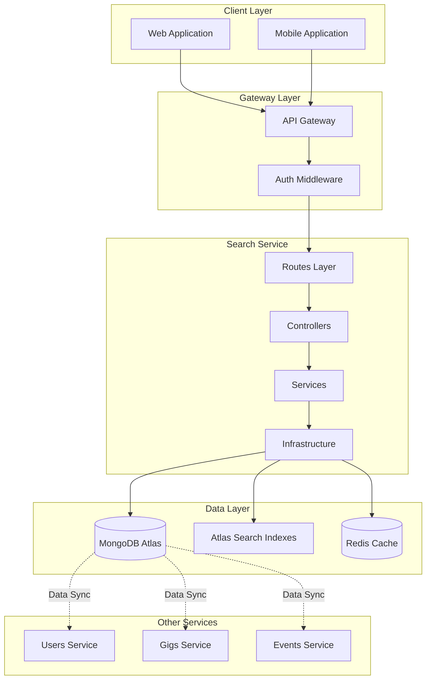
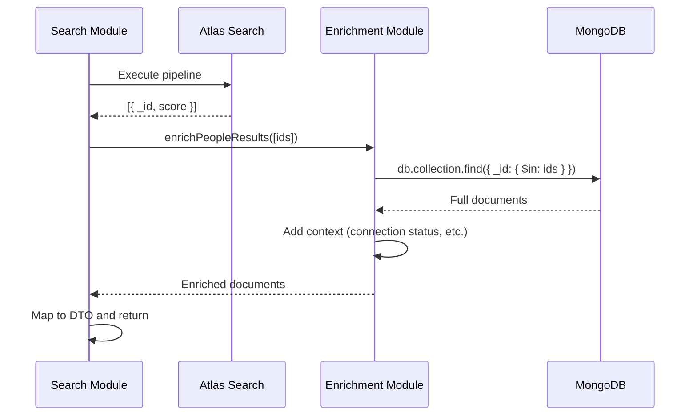
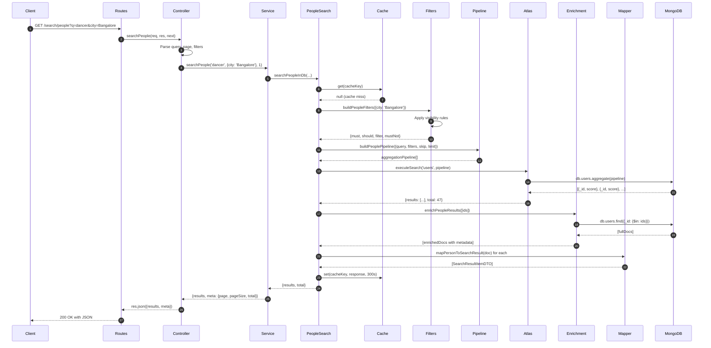

# Architecture Deep Dive

> **Document Index:** [02] Architecture  
> **Previous:** [01-api-reference.md](./01-api-reference.md) | **Next:** [03-search-implementation.md](./03-search-implementation.md)

---

## Table of Contents

1. [System Architecture](#system-architecture)
2. [Layered Architecture](#layered-architecture)
3. [Component Breakdown](#component-breakdown)
4. [Data Flow](#data-flow)
5. [Module Structure](#module-structure)
6. [Design Patterns](#design-patterns)
7. [Infrastructure Components](#infrastructure-components)
8. [Scaling Considerations](#scaling-considerations)

---

## System Architecture

### High-Level Context



### Service Responsibilities

| Component | Responsibility |
|-----------|----------------|
| **Search Service** | Provides search APIs across all verticals |
| **Users Service** | Manages user profiles and authentication |
| **Gigs Service** | Handles gig creation, updates, and lifecycle |
| **Events Service** | Manages event data and registrations |
| **API Gateway** | Routes requests, handles auth, rate limiting |

---

## Layered Architecture

The service follows a **clean, layered architecture** with clear separation of concerns:

```
┌──────────────────────────────────────────────────┐
│  Layer 1: API / Routes                           │
│  - HTTP endpoint definitions                     │
│  - Route binding                                 │
│  Path: src/modules/search/search.routes.ts       │
└────────────────┬─────────────────────────────────┘
                 │
┌────────────────▼─────────────────────────────────┐
│  Layer 2: Controllers                            │
│  - Request/response handling                     │
│  - Input validation                              │
│  - Error handling                                │
│  Path: src/modules/search/search.controller.ts   │
└────────────────┬─────────────────────────────────┘
                 │
┌────────────────▼─────────────────────────────────┐
│  Layer 3: Services (Orchestration)               │
│  - Business logic coordination                   │
│  - Multi-module orchestration                    │
│  Paths:                                          │
│  - src/modules/search/search.service.ts          │
│  - src/modules/search/search.preview.service.ts  │
└────┬──────────────────────┬──────────────────────┘
     │                      │
┌────▼────────┐      ┌──────▼─────────┐
│ Layer 4A:   │      │ Layer 4B:      │
│ Search      │      │ Enrichment     │
│ Modules     │      │ Modules        │
│             │      │                │
│ - people    │      │ - enrich.people│
│ - gigs      │      │ - enrich.gigs  │
│ - events    │      │ - enrich.events│
└────┬────────┘      └──────┬─────────┘
     │                      │
┌────▼──────────────────────▼──────────────────────┐
│  Layer 5: Infrastructure                         │
│  - Atlas Search Client                           │
│  - Cache Service                                 │
│  - Database Connection                           │
│  Paths:                                          │
│  - src/infra/search/atlas.client.ts              │
│  - src/cache/cache.service.ts                    │
│  - src/config/mongo.ts                           │
└──────────────────────────────────────────────────┘
```

### Layer Responsibilities

#### Layer 1: API/Routes
- **Purpose**: Define HTTP endpoints and bind them to controller methods
- **Key Files**: 
  - `src/modules/search/search.routes.ts`
- **Dependencies**: Express Router, Controllers

#### Layer 2: Controllers
- **Purpose**: Handle HTTP-specific concerns (req/res)
- **Key Files**:
  - `src/modules/search/search.controller.ts`
- **Responsibilities**:
  - Parse query parameters
  - Extract user context from headers
  - Call service layer
  - Format responses
  - Delegate error handling to middleware

#### Layer 3: Services
- **Purpose**: Orchestrate business logic
- **Key Files**:
  - `src/modules/search/search.service.ts` - Main orchestration
  - `src/modules/search/search.preview.service.ts` - Preview logic
- **Responsibilities**:
  - Coordinate between search and enrichment modules
  - Apply pagination logic
  - Aggregate results

#### Layer 4A: Search Modules
- **Purpose**: Execute search queries for specific verticals
- **Key Files**:
  - `src/modules/people/people.search.ts`
  - `src/modules/gigs/gigs.search.ts`
  - `src/modules/events/events.search.ts`
- **Responsibilities**:
  - Build filters
  - Construct Atlas Search pipelines
  - Execute searches via infrastructure
  - Apply caching

#### Layer 4B: Enrichment Modules
- **Purpose**: Fetch full documents and add contextual data
- **Key Files**:
  - `src/modules/enrichment/enrich.people.ts`
  - `src/modules/enrichment/enrich.gigs.ts`
  - `src/modules/enrichment/enrich.events.ts`
- **Responsibilities**:
  - Batch fetch documents by ID
  - Add connection status, expiration info, etc.
  - Preserve sort order from search

#### Layer 5: Infrastructure
- **Purpose**: Provide low-level data access and caching
- **Key Files**:
  - `src/infra/search/atlas.client.ts` - Atlas Search wrapper
  - `src/cache/cache.service.ts` - Redis abstraction
  - `src/config/mongo.ts` - DB connection
- **Responsibilities**:
  - Execute aggregation pipelines
  - Manage cache reads/writes
  - Handle connection lifecycle

---

## Component Breakdown

### 1. Search Module (`src/modules/search/`)

**Purpose**: Main entry point for all search operations

#### Files:

```
src/modules/search/
├── search.routes.ts          # Route definitions
├── search.controller.ts      # Request handlers
├── search.service.ts         # Main service orchestration
├── search.preview.service.ts # Preview-specific logic
└── dto/
    ├── search-query.dto.ts   # Query input types
    └── search-response.dto.ts # Response formats
```

#### Key Classes:

**`SearchController`**
```typescript
class SearchController {
  async previewSearch(req, res, next)  // GET /search/preview
  async searchPeople(req, res, next)   // GET /search/people
  async searchGigs(req, res, next)     // GET /search/gigs
  async searchEvents(req, res, next)   // GET /search/events
}
```

**`SearchService`**
```typescript
class SearchService {
  async searchPeople(query, filters, page, userId)
  async searchGigs(query, filters, page)
  async searchEvents(query, filters, page)
}
```

**`SearchPreviewService`**
```typescript
class SearchPreviewService {
  async executePreview(query) {
    // Searches all verticals concurrently
    const [people, gigs, events] = await Promise.all([...])
    return { people: top5, gigs: top5, events: top5 }
  }
}
```

---

### 2. Vertical Search Modules

Each vertical (People, Gigs, Events) has a consistent structure:

```
src/modules/people/
├── people.search.ts    # Search execution
├── people.filters.ts   # Filter building
└── people.mapper.ts    # Result mapping
```

#### People Module (`src/modules/people/`)

**`people.search.ts`**
```typescript
export const searchPeopleInDb = async (
  query: string,
  filters: Record<string, any>,
  page: number,
  pageSize: number,
  currentUserId?: string
) => {
  // 1. Check cache
  // 2. Build filters with visibility rules
  // 3. Construct Atlas pipeline
  // 4. Execute search (returns IDs + scores)
  // 5. Enrich with full documents
  // 6. Map to DTO format
  // 7. Cache and return
}
```

**`people.filters.ts`**
```typescript
export const buildPeopleFilters = (filters) => {
  // Build must, should, filter, mustNot clauses
  // Apply visibility rules
  // Parse artistType, city, rating filters
}
```

**`people.mapper.ts`**
```typescript
export const mapPersonToSearchResult = (doc) => ({
  id: doc._id.toString(),
  type: 'people',
  title: doc.displayName,
  subtitle: `${doc.artistType} • ${doc.city}`,
  image: doc.profilePicture,
  score: doc.score,
  metadata: { username, rating, verified }
})
```

> **Note**: Gigs and Events modules follow the same structure.

---

### 3. Enrichment Module (`src/modules/enrichment/`)

**Purpose**: Transform sparse search results (ID + score) into full documents with context

#### Workflow:



#### Example: `enrich.people.ts`

```typescript
export const enrichPeopleResults = async (
  originalIds: string[],
  viewerId?: string
) => {
  // 1. Convert IDs to ObjectIds
  const objectIds = originalIds.map(id => new ObjectId(id))
  
  // 2. Batch fetch from MongoDB
  const docs = await mongoose.connection.db
    .collection('users')
    .find({ _id: { $in: objectIds } })
    .toArray()
  
  // 3. Add contextual fields
  return originalIds.map(id => {
    const doc = docMap.get(id)
    return {
      ...doc,
      connectionStatus: 'none' // TODO: Check if connected to viewer
    }
  })
}
```

---

### 4. Infrastructure Layer (`src/infra/`)

#### Atlas Client (`src/infra/search/atlas.client.ts`)

**Purpose**: Abstract MongoDB Atlas Search aggregation

```typescript
class AtlasClient {
  async executeSearch(
    collectionName: string,
    pipeline: any[]
  ): Promise<SearchResponse> {
    // Execute aggregation pipeline
    const result = await mongoose.connection.db
      .collection(collectionName)
      .aggregate(pipeline)
      .toArray()
    
    // Parse faceted or flat results
    // Return { results: [{_id, score}], total }
  }
}
```

#### Pipeline Builders (`src/infra/search/pipelines/`)

Each vertical has a pipeline builder:

**`people.pipeline.ts`**
```typescript
export function buildPeoplePipeline({
  query, filters, limit, skip
}) {
  return [
    { $search: {
        index: 'people_search_index',
        compound: {
          must: [...mustClauses],
          should: [...shouldClauses],
          minimumShouldMatch: 1
        }
      }
    },
    { $addFields: { _score: { $meta: 'searchScore' } } },
    { $sort: { _score: -1, 'cached.averageRating': -1 } },
    { $skip: skip },
    { $limit: limit },
    { $project: { email: 0, passwordHash: 0 } } // Exclude sensitive fields
  ]
}
```

---

### 5. Ranking System (`src/ranking/`)

**Purpose**: Centralized scoring and boosting logic

#### File Structure:

```
src/ranking/
├── weights.ts         # Centralized weight configuration
├── people.rank.ts     # People-specific ranking clauses
├── gigs.rank.ts       # Gigs-specific ranking clauses
└── events.rank.ts     # Events-specific ranking clauses
```

#### Example: `weights.ts`

```typescript
export const PEOPLE_WEIGHTS = {
  NAME_MATCH: 3.0,
  ARTIST_TYPE_MATCH: 2.0,
  RATING_BOOST: 1.5,
  FEATURED_BOOST: 5.0
}

export const GIGS_WEIGHTS = {
  TITLE_MATCH: 3.0,
  ARTIST_TYPE_MATCH: 2.0,
  CITY_MATCH: 1.5,
  URGENT_BOOST: 5.0
}
```

#### Example: `people.rank.ts`

```typescript
export const buildPeopleRankingClauses = (query: string) => {
  const clauses = []
  
  // Name match with autocomplete
  clauses.push({
    autocomplete: {
      query: query,
      path: 'displayName',
      score: { boost: { value: PEOPLE_WEIGHTS.NAME_MATCH } },
      fuzzy: { maxEdits: 1 }
    }
  })
  
  // Rating boost for high-rated artists
  clauses.push({
    range: {
      path: 'cached.averageRating',
      gte: 4,
      score: { boost: { value: PEOPLE_WEIGHTS.RATING_BOOST } }
    }
  })
  
  return clauses
}
```

---

### 6. Caching Layer (`src/cache/`)

#### Components:

```
src/cache/
├── cache.client.ts    # Redis wrapper
├── cache.service.ts   # High-level cache API
└── cache.keys.ts      # Key generation logic
```

#### Cache Key Generation

```typescript
export const generateSearchKey = (
  index: string,
  query: string,
  filters: Record<string, any>,
  page: number,
  pageSize: number
): string => {
  const filtersString = stableStringify(filters)
  const payload = `${index}:${query}:${filtersString}:${page}:${pageSize}`
  const hash = createMd5Hash(payload)
  return `search:${index}:${hash}`
}
```

**Example Cache Keys:**
```
search:people:a3f2b1c9d8e7f6a5b4c3d2e1
search:gigs:b4g3c2d1e0f9a8b7c6d5e4f3
```

#### Cache Service

```typescript
export const cacheService = {
  get: async <T>(key: string): Promise<T | null> => {
    const data = await cacheClient.get(key)
    return data ? JSON.parse(data) : null
  },
  
  set: async (key: string, value: any, ttl = 300) => {
    await cacheClient.set(key, JSON.stringify(value), ttl)
  }
}
```

> **Note**: Caching is currently **disabled** in the codebase (returns null). Enable by uncommenting the implementation.

---

### 7. Permissions & Visibility (`src/permissions/`)

**Purpose**: Enforce data access rules and privacy

#### Files:

```
src/permissions/
├── people.visibility.ts
├── gigs.visibility.ts
└── events.visibility.ts
```

#### Example: `people.visibility.ts`

```typescript
export const buildPeopleVisibility = (context = {}) => {
  const filter = []
  const mustNot = []
  
  // Exclude blocked users
  if (context.blockedUserIds?.length > 0) {
    mustNot.push({
      in: {
        path: '_id',
        value: context.blockedUserIds
      }
    })
  }
  
  // Future: Add privacy flag checks
  // filter.push({ term: { path: 'isPublic', value: true } })
  
  return { filter, mustNot }
}
```

---

## Data Flow

### End-to-End Request Flow: `/search/people?q=dancer&city=Bangalore`



### Key Steps:

1. **Route binding** - Express routes request to controller
2. **Parsing** - Controller extracts query params and user context
3. **Service orchestration** - Delegates to vertical-specific search
4. **Cache check** - Attempts to serve from Redis
5. **Filter building** - Constructs Atlas Search filter clauses
6. **Pipeline construction** - Builds aggregation pipeline
7. **Search execution** - Atlas Search returns IDs + scores
8. **Enrichment** - Fetches full documents from MongoDB
9. **Mapping** - Transforms to standardized DTO
10. **Caching** - Stores result in Redis
11. **Response** - Returns paginated JSON to client

---

## Design Patterns

### 1. **Service Layer Pattern**

Controllers delegate all business logic to service classes:

```typescript
// Controller (thin)
async searchPeople(req, res, next) {
  const results = await searchService.searchPeople(q, filters, page, userId)
  return res.json(results)
}

// Service (thick)
class SearchService {
  async searchPeople(...) {
    // Orchestration logic
    const {results, total} = await searchPeopleInDb(...)
    return {results, meta: {page, pageSize, total}}
  }
}
```

### 2. **Repository Pattern**

Infrastructure layer abstracts data access:

```typescript
// Instead of directly calling MongoDB everywhere:
mongoose.connection.db.collection('users').aggregate(...)

// We use:
atlasClient.executeSearch('users', pipeline)
```

### 3. **Strategy Pattern**

Interchangeable ranking and filter strategies:

```typescript
// People ranking
const rankingClauses = buildPeopleRankingClauses(query)

// Gigs ranking (different strategy)
const rankingClauses = buildGigsRankingClauses(query)
```

### 4. **Pipeline Pattern**

Aggregation pipelines constructed via composable functions:

```typescript
const pipeline = [
  ...searchStage,
  ...scoringStage,
  ...sortingStage,
  ...paginationStage,
  ...projectionStage
]
```

### 5. **Decorator/Enrichment Pattern**

Search results progressively enhanced:

```
Search Result → Enrichment → Mapping → Final DTO
ID + Score  →  Full Doc     → Standard → Client
```

---

## Scaling Considerations

### Vertical Scaling

- **MongoDB Atlas**: Increase cluster tier for more vCPUs and RAM
- **Redis**: Provision larger cache instances
- **Service Instances**: Increase container memory/CPU limits

### Horizontal Scaling

- **Stateless Service**: Deploy multiple instances behind load balancer
- **Shared Cache**: All instances use same Redis cluster
- **Connection Pooling**: Mongoose handles connection pooling automatically

### Performance Optimization

1. **Caching**: Enable Redis caching (currently disabled)
2. **Index Optimization**: Tune Atlas Search index mappings
3. **Projection**: Only fetch required fields from MongoDB
4. **Batch Enrichment**: Single multi-ID query instead of N+1

### Monitoring

Recommended metrics:
- **Latency**: P50, P95, P99 per endpoint
- **Throughput**: Requests/second
- **Cache Hit Rate**: % of requests served from cache
- **Error Rate**: 5xx errors per minute
- **Database Load**: Atlas metrics (CPU, memory, connections)

---

**Document Index:** [02] Architecture  
**Previous:** [01-api-reference.md](./01-api-reference.md) | **Next:** [03-search-implementation.md](./03-search-implementation.md)
