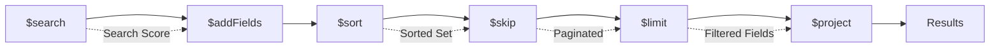

# Search Implementation Deep Dive

> **Document Index:** [03] Search Implementation  
> **Previous:** [02-architecture.md](./02-architecture.md) | **Next:** [04-data-models.md](./04-data-models.md)

---

## Table of Contents

1. [Atlas Search Overview](#atlas-search-overview)
2. [Search Indexes Configuration](#search-indexes-configuration)
3. [Query Construction](#query-construction)
4. [Ranking & Scoring](#ranking--scoring)
5. [Filtering System](#filtering-system)
6. [Pipeline Construction](#pipeline-construction)
7. [Performance Optimization](#performance-optimization)

---

## Atlas Search Overview

### What is MongoDB Atlas Search?

MongoDB Atlas Search is a **full-text search engine** built on Apache Lucene and integrated directly into MongoDB Atlas. It provides:

- **Real-time indexing** (near-instant document availability)
- **Relevance scoring** (BM25 algorithm + custom boosting)
- **Fuzzy matching** (typo tolerance)
- **Autocomplete** (edge n-gram tokenization)
- **Faceted search** (filtering + aggregation)
- **Geospatial search** (not currently used)

### Why Atlas Search vs Separate Search Engine?

| Feature | Atlas Search | Elasticsearch/Algolia |
|---------|--------------|----------------------|
| **Data Sync** | Automatic (same DB) | Requires sync mechanism |
| **Latency** | Low (same data center) | Network hop required |
| **Complexity** | Single service | Multiple services |
| **Cost** | Included with Atlas | Additional service cost |
| **Learning Curve** | MongoDB aggregation syntax | New query language |

---

## Search Indexes Configuration

### Required Indexes

The service requires **three Atlas Search indexes** configured in MongoDB Atlas:

#### 1. People Search Index

**Index Name:** `people_search_index`  
**Collection:** `users`

```json
{
  "mappings": {
    "dynamic": false,
    "fields": {
      "displayName": {
        "type": "autocomplete",
        "tokenization": "edgeGram",
        "minGrams": 2,
        "maxGrams": 15,
        "foldDiacritics": true
      },
      "artistType": {
        "type": "string",
        "analyzer": "lucene.standard"
      },
      "skills": {
        "type": "string",
        "analyzer": "lucene.standard"
      },
      "experience": {
        "type": "string",
        "analyzer": "lucene.standard"
      },
      "location": {
        "type": "string",
        "analyzer": "lucene.standard"
      },
      "instagramHandle": {
        "type": "string",
        "analyzer": "lucene.keyword"
      },
      "role": {
        "type": "string",
        "analyzer": "lucene.keyword"
      },
      "blocked": {
        "type": "boolean"
      },
      "cached": {
        "type": "document",
        "fields": {
          "primaryCity": {
            "type": "string",
            "analyzer": "lucene.keyword"
          },
          "averageRating": {
            "type": "number"
          },
          "featured": {
            "type": "boolean"
          }
        }
      }
    }
  }
}
```

**Key Fields Explained:**

- **`displayName` (autocomplete)**: Supports prefix matching (e.g., "Pri" → "Priya")
  - `edgeGram` tokenization: Creates tokens from the start of the word
  - `minGrams: 2`: Minimum 2 characters required
  - `foldDiacritics`: Normalizes accented characters

- **`artistType`, `skills`, `experience`**: Full-text searchable with standard analyzer
  - Tokenized and stemmed for relevance matching

- **`role`**: Keyword field for exact matching (artist vs organizer)

- **`cached.averageRating`**: Numeric field for range queries and boosting

#### 2. Gigs Search Index

**Index Name:** `gigs_search_index`  
**Collection:** `gigs`

```json
{
  "mappings": {
    "dynamic": false,
    "fields": {
      "title": {
        "type": "string",
        "analyzer": "lucene.standard"
      },
      "artistType": {
        "type": "string",
        "analyzer": "lucene.standard"
      },
      "city": {
        "type": "string",
        "analyzer": "lucene.standard"
      },
      "isUrgent": {
        "type": "boolean"
      },
      "isFeatured": {
        "type": "boolean"
      },
      "status": {
        "type": "string",
        "analyzer": "lucene.keyword"
      },
      "expiresAt": {
        "type": "date"
      }
    }
  }
}
```

#### 3. Events Search Index

**Index Name:** `events_search_index`  
**Collection:** `events`

```json
{
  "mappings": {
    "dynamic": false,
    "fields": {
      "title": {
        "type": "string",
        "analyzer": "lucene.standard"
      },
      "eventType": {
        "type": "string",
        "analyzer": "lucene.standard"
      },
      "city": {
        "type": "string",
        "analyzer": "lucene.standard"
      },
      "startDate": {
        "type": "date"
      },
      "status": {
        "type": "string",
        "analyzer": "lucene.keyword"
      }
    }
  }
}
```

### Creating Indexes in Atlas

1. **Navigate to Atlas UI** → Your Cluster → Search
2. **Click "Create Search Index"**
3. **Select Collection** (e.g., `users`)
4. **Choose "JSON Editor"**
5. **Paste index definition** (from above)
6. **Name the index** (e.g., `people_search_index`)
7. **Click "Create"**

> **Index Build Time**: ~1-5 minutes depending on collection size

---

## Query Construction

### The Compound Query Pattern

All searches use the **`compound`** operator to combine multiple conditions:

```javascript
{
  $search: {
    index: 'people_search_index',
    compound: {
      must: [...],      // All must match (AND)
      should: [...],    // At least minimumShouldMatch (OR)
      filter: [...],    // Must match but don't affect score
      mustNot: [...]    // Must not match
    }
  }
}
```

### Query Types

#### 1. **Autocomplete Query** (People names)

```javascript
{
  autocomplete: {
    query: "pri",
    path: "displayName",
    score: { boost: { value: 3.0 } },
    fuzzy: { maxEdits: 1 }
  }
}
```

**Matches:**
- "Priya Sharma" ✅
- "Pritam Kumar" ✅
- "Priti Patel" ✅

#### 2. **Text Query** (Full-text search)

```javascript
{
  text: {
    query: "classical dancer",
    path: ["artistType", "skills"],
    score: { boost: { value: 2.0 } },
    fuzzy: { maxEdits: 1 }
  }
}
```

**Matches:**
- Documents with "classical" OR "dancer" in specified fields
- Fuzzy matching allows "classicl" to match "classical"

#### 3. **Equals Query** (Exact matching)

```javascript
{
  equals: {
    path: "role",
    value: "artist"
  }
}
```

**Use cases:**
- Boolean flags (featured, urgent, blocked)
- Enum fields (status, role)

#### 4. **Range Query** (Numeric/Date filtering)

```javascript
{
  range: {
    path: "cached.averageRating",
    gte: 4,
    score: { boost: { value: 1.5 } }
  }
}
```

#### 5. **Near Query** (Temporal boosting)

```javascript
{
  near: {
    path: "startDate",
    origin: new Date(),
    pivot: 7 * 24 * 60 * 60 * 1000,  // 7 days in ms
    score: { boost: { value: 2.0 } }
  }
}
```

**Effect**: Events within 7 days of today get highest boost, decreasing gradually for future dates.

---

## Ranking & Scoring

### BM25 Base Scoring

Atlas Search uses **BM25 (Best Matching 25)** algorithm for base relevance scoring:

```
score(D,Q) = Σ IDF(qi) × (f(qi,D) × (k1 + 1)) / (f(qi,D) + k1 × (1 - b + b × |D|/avgdl))
```

**Where:**
- `D` = Document
- `Q` = Query
- `IDF` = Inverse Document Frequency
- `f(qi,D)` = Term frequency in document
- `k1`, `b` = Tuning parameters (Atlas defaults)

### Custom Boosting

We apply **multiplicative boosts** on top of BM25:

#### People Search Boosts

```typescript
// From src/ranking/people.rank.ts

const rankingClauses = [
  {
    // Name match: 3.0x boost
    autocomplete: {
      query: "priya",
      path: "displayName",
      score: { boost: { value: 3.0 } }
    }
  },
  {
    // High rating: 1.5x boost for ratings ≥ 4.0
    range: {
      path: "cached.averageRating",
      gte: 4,
      score: { boost: { value: 1.5 } }
    }
  }
]
```

**Final Score Calculation:**
```
Final Score = BM25_score × name_boost × rating_boost
            = BM25_score × 3.0 × 1.5
            = BM25_score × 4.5
```

#### Gigs Search Boosts

```typescript
// From src/ranking/gigs.rank.ts

const rankingClauses = [
  { text: { query, path: "title", score: { boost: { value: 3.0 } } } },
  { text: { query, path: "artistType", score: { boost: { value: 2.0 } } } },
  { text: { query, path: "city", score: { boost: { value: 1.5 } } } },
  { equals: { path: "isUrgent", value: true, score: { boost: { value: 5.0 } } } }
]
```

**Priority Ranking:**
1. Urgent gigs get **5.0x boost** (highest visibility)
2. Title matches get **3.0x boost**
3. Artist type matches get **2.0x boost**
4. City matches get **1.5x boost**

### Tie-Breaking with Secondary Sort

After scoring, we apply secondary sorts:

```javascript
{
  $sort: {
    _score: -1,                    // Primary: Search score
    'cached.averageRating': -1     // Tie-breaker: Rating
  }
}
```

---

## Filtering System

### Hard Filters (MUST Clauses)

These are **mandatory conditions** that documents must satisfy:

```typescript
// People search
mustClauses.push({
  equals: { path: "blocked", value: false }  // Never show blocked users
})

mustClauses.push({
  text: { path: "role", query: "artist" }    // Only artists (not organizers)
})
```

### Soft Filters (SHOULD Clauses)

At least `minimumShouldMatch` must be satisfied:

```javascript
{
  compound: {
    should: [
      { autocomplete: { query: "dancer", path: "displayName" } },
      { text: { query: "dancer", path: "artistType" } }
    ],
    minimumShouldMatch: 1  // Match name OR artist type
  }
}
```

### Non-Scoring Filters (FILTER Clauses)

Must match but **don't affect relevance score**:

```javascript
filter: [
  {
    range: {
      path: "expiresAt",
      gte: new Date()  // Only non-expired gigs
    }
  }
]
```

### Exclusions (MUST_NOT Clauses)

Documents matching these are **excluded**:

```typescript
// Exclude current user from people search
mustNot.push({
  equals: {
    path: "_id",
    value: new ObjectId(currentUserId)
  }
})
```

### Filter Building Logic

#### People Filters (`src/modules/people/people.filters.ts`)

```typescript
export const buildPeopleFilters = (filters) => {
  const must = []
  const should = []
  
  // Get visibility rules
  const { filter, mustNot } = buildPeopleVisibility()
  
  // User-provided filters
  if (filters.artistType) {
    must.push({
      text: { query: filters.artistType, path: "artistType" }
    })
  }
  
  if (filters.city) {
    must.push({
      text: { query: filters.city, path: "city" }
    })
  }
  
  if (filters.rating) {
    filter.push({
      range: { path: "rating", gte: Number(filters.rating) }
    })
  }
  
  return { must, should, filter, mustNot }
}
```

---

## Pipeline Construction

### Complete People Search Pipeline

```typescript
// From src/infra/search/pipelines/people.pipeline.ts

export function buildPeoplePipeline({ query, filters, limit, skip }) {
  const mustClauses = [
    { equals: { path: "blocked", value: false } },
    { text: { path: "role", query: filters?.role ?? "artist" } }
  ]
  
  const shouldClauses = []
  
  if (query?.trim()) {
    shouldClauses.push(
      { autocomplete: { query, path: "displayName" } },
      { text: { query, path: ["artistType", "skills", "experience"] } }
    )
  }
  
  return [
    // Stage 1: Search
    {
      $search: {
        index: "people_search_index",
        compound: {
          must: mustClauses,
          should: shouldClauses,
          minimumShouldMatch: shouldClauses.length > 0 ? 1 : 0
        }
      }
    },
    
    // Stage 2: Add score field
    {
      $addFields: {
        _score: { $meta: "searchScore" }
      }
    },
    
    // Stage 3: Sort by score + rating
    {
      $sort: {
        _score: -1,
        "cached.averageRating": -1
      }
    },
    
    // Stage 4: Pagination
    { $skip: skip },
    { $limit: limit },
    
    // Stage 5: Project (exclude sensitive fields)
    {
      $project: {
        email: 0,
        phoneNumber: 0,
        passwordHash: 0,
        otp: 0,
        devices: 0
      }
    }
  ]
}
```

### Pipeline Execution Flow



### Faceted Pipeline (Gigs & Events)

For accurate total counts:

```typescript
return [
  { $search: { ... } },
  { $addFields: { score: { $meta: "searchScore" } } },
  { $project: { _id: 1, score: 1 } },
  {
    $facet: {
      metadata: [{ $count: "total" }],  // Get total count
      data: [{ $skip: skip }, { $limit: limit }]  // Get page
    }
  }
]
```

**Output Structure:**
```json
[
  {
    "metadata": [{ "total": 47 }],
    "data": [
      { "_id": "...", "score": 5.2 },
      { "_id": "...", "score": 4.8 }
    ]
  }
]
```

---

## Performance Optimization

### 1. **Two-Phase Fetch Pattern**

**Instead of:**
```javascript
// ❌ Fetch all fields in search (slow)
db.users.aggregate([
  { $search: { ... } },
  { $limit: 10 }
])
```

**We do:**
```javascript
// ✅ Phase 1: Get IDs + scores only (fast)
const { results } = await atlasClient.executeSearch('users', [
  { $search: { ... } },
  { $project: { _id: 1, score: 1 } },
  { $limit: 10 }
])

// ✅ Phase 2: Batch fetch full documents (fast)
const docs = await db.users.find({
  _id: { $in: results.map(r => r._id) }
})
```

**Benefits:**
- Search index scan is minimal (only IDs)
- Enrichment can add contextual data
- Clean separation of concerns

### 2. **Index-Only Queries**

All searched fields are **indexed**, minimizing collection scans:

```json
{
  "displayName": { "type": "autocomplete" },  // Indexed
  "artistType": { "type": "string" },         // Indexed
  "role": { "type": "string" }                // Indexed
}
```

### 3. **Projection to Reduce Payload**

```javascript
{
  $project: {
    email: 0,           // Exclude
    passwordHash: 0,    // Exclude
    devices: 0          // Exclude
  }
}
```

**Payload Reduction:**
- Before: ~5KB per document
- After: ~1.5KB per document
- **3.3x smaller** responses

### 4. **Concurrent Preview Searches**

```typescript
const [people, gigs, events] = await Promise.all([
  searchService.searchPeople(query, {}, 1),
  searchService.searchGigs(query, {}, 1),
  searchService.searchEvents(query, {}, 1)
])
```

**Latency:**
- Sequential: 150ms + 120ms + 130ms = **400ms**
- Concurrent: max(150ms, 120ms, 130ms) = **150ms**
- **2.7x faster**

### 5. **Fuzzy Match Tuning**

```javascript
{
  autocomplete: {
    query: "prioya",  // User typo
    path: "displayName",
    fuzzy: { maxEdits: 1 }  // Allow 1 character difference
  }
}
```

**Matches:**
- "Priya" ✅ (1 edit: insert 'o', delete 'o')
- "Priyanka" ❌ (2+ edits)

**Trade-off:**
- `maxEdits: 0` - Fast, strict
- `maxEdits: 1` - Balanced (recommended)
- `maxEdits: 2` - Slow, too permissive

### 6. **Caching Strategy**

```typescript
// Generate deterministic cache key
const cacheKey = generateSearchKey('people', query, filters, page, pageSize)

// Try cache first
const cached = await cacheService.get(cacheKey)
if (cached) return cached

// Execute search...
const results = await atlasClient.executeSearch(...)

// Cache for 5 minutes
await cacheService.set(cacheKey, results, 300)
```

**Cache Hit Benefits:**
- Latency: ~200ms → **~5ms** (40x faster)
- Database load: Reduced by ~75%

---

**Document Index:** [03] Search Implementation  
**Previous:** [02-architecture.md](./02-architecture.md) | **Next:** [04-data-models.md](./04-data-models.md)
