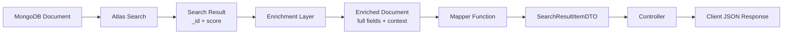

# Data Models & Schemas

> **Document Index:** [04] Data Models  
> **Previous:** [03-search-implementation.md](./03-search-implementation.md) | **Next:** [05-caching-strategy.md](./05-caching-strategy.md)

---

## Table of Contents

1. [DTOs (Data Transfer Objects)](#dtos-data-transfer-objects)
2. [Database Schemas](#database-schemas)
3. [Search Result Models](#search-result-models)
4. [Type Definitions](#type-definitions)
5. [Mappers](#mappers)

---

## DTOs (Data Transfer Objects)

### SearchResultItemDTO

**Location:** `src/modules/search/dto/search-response.dto.ts`

The **standardized format** for all search results across verticals:

```typescript
export interface SearchResultItemDTO {
  id: string;                    // Document ID (string)
  type: 'people' | 'gig' | 'event';  // Result type
  title: string;                 // Primary display text
  subtitle: string;              // Secondary context
  image: string;                 // Thumbnail/profile picture URL
  score: number;                 // Atlas Search relevance score
  metadata: Record<string, any>; // Type-specific metadata
}
```

### Example Instances

#### People Result

```json
{
  "id": "65f123abc456def789012345",
  "type": "people",
  "title": "Priya Sharma",
  "subtitle": "Classical Dancer • Bangalore",
  "image": "https://cdn.netsaa.com/profiles/priya.jpg",
  "score": 4.5,
  "metadata": {
    "username": "priya_dancer",
    "rating": 4.8,
    "verified": true
  }
}
```

#### Gig Result

```json
{
  "id": "65f234bcd567efg890123456",
  "type": "gig",
  "title": "Lead Guitarist for Rock Concert",
  "subtitle": "Mumbai • Guitarist",
  "image": "https://cdn.netsaa.com/gigs/concert.jpg",
  "score": 6.8,
  "metadata": {
    "compensation": "₹15000",
    "date": "2026-02-28T19:00:00Z",
    "expiresAt": "2026-02-20T00:00:00Z"
  }
}
```

#### Event Result

```json
{
  "id": "65f345cde678fgh901234567",
  "type": "event",
  "title": "Classical Music Evening",
  "subtitle": "Concert • Delhi",
  "image": "https://cdn.netsaa.com/events/classical.jpg",
  "score": 4.5,
  "metadata": {
    "startDate": "2026-02-10T18:00:00Z",
    "endDate": "2026-02-10T21:00:00Z",
    "venue": "India Habitat Centre"
  }
}
```

### SearchQueryDTO

**Location:** `src/modules/search/dto/search-query.dto.ts`

```typescript
export interface SearchQueryDTO {
  q: string;                          // Search query
  page?: number;                      // Page number (default: 1)
  pageSize?: number;                  // Results per page (default: 10)
  filters?: Record<string, any>;      // Vertical-specific filters
}
```

### Search Response Structure

```typescript
export interface SearchResponse<T = SearchResultItemDTO> {
  results: T[];
  meta: {
    page: number;
    pageSize: number;
    total: number;
  };
}
```

### Preview Search Response

```typescript
export interface PreviewSearchResponse {
  people: SearchResultItemDTO[];  // Top 5 people
  gigs: SearchResultItemDTO[];    // Top 5 gigs
  events: SearchResultItemDTO[];  // Top 5 events
}
```

---

## Database Schemas

### Users Collection (People Search)

**Collection:** `users`  
**Database:** `netsa`

```typescript
interface UserDocument {
  _id: ObjectId;
  
  // Identity
  firstName: string;
  lastName: string;
  displayName: string;
  username: string;
  email: string;
  phoneNumber?: string;
  
  // Profile
  profilePicture?: string;
  bio?: string;
  role: 'artist' | 'organizer';
  
  // Artist-specific
  artistType?: string;           // e.g., "Dancer", "Musician"
  skills?: string[];
  experience?: string;
  instagramHandle?: string;
  portfolioLinks?: string[];
  
  // Location
  city?: string;
  location?: string;
  
  // Status
  blocked: boolean;              // Visibility control
  isVerified: boolean;
  
  // Cached/Computed Fields
  cached: {
    primaryCity?: string;
    averageRating?: number;      // 0-5
    totalReviews?: number;
    featured?: boolean;
    connectionCount?: number;
  };
  
  // Authentication (excluded from search results)
  passwordHash?: string;
  otp?: string;
  otpExpires?: Date;
  devices?: any[];
  
  // Timestamps
  createdAt: Date;
  updatedAt: Date;
}
```

### Gigs Collection

**Collection:** `gigs`  
**Database:** `netsa`

```typescript
interface GigDocument {
  _id: ObjectId;
  
  // Basic Info
  title: string;                 // e.g., "Guitarist needed for Wedding"
  description: string;
  
  // Categorization
  artistType: string;            // e.g., "Musician", "Dancer"
  city: string;
  venue?: string;
  
  // Organizer
  organizerId: ObjectId;
  organizerName?: string;
  organizerProfilePicture?: string;
  
  // Event Details
  eventDate?: Date;
  date?: Date;
  duration?: string;
  
  // Compensation
  compensation?: string;         // e.g., "₹5000", "Paid", "Unpaid"
  compensationType?: 'paid' | 'unpaid' | 'negotiable';
  
  // Media
  thumbnail?: string;
  images?: string[];
  
  // Status
  status: 'draft' | 'published' | 'closed' | 'expired';
  isUrgent: boolean;             // Boosted in search
  isFeatured: boolean;           // Boosted in search
  expiresAt?: Date;
  
  // Timestamps
  createdAt: Date;
  updatedAt: Date;
}
```

### Events Collection

**Collection:** `events`  
**Database:** `netsa`

```typescript
interface EventDocument {
  _id: ObjectId;
  
  // Basic Info
  title: string;                 // e.g., "Classical Music Festival 2026"
  description: string;
  
  // Categorization
  eventType: string;             // e.g., "Concert", "Workshop", "Festival"
  category?: string;
  
  // Location
  city: string;
  venue: string;
  address?: string;
  
  // Organizer
  organizerId: ObjectId;
  organizerName?: string;
  
  // Timing
  startDate: Date;
  endDate: Date;
  
  // Media
  coverImage?: string;
  images?: string[];
  
  // Registration
  registrationRequired: boolean;
  registrationDeadline?: Date;
  capacity?: number;
  
  // Status
  status: 'draft' | 'published' | 'cancelled' | 'completed';
  visibility: 'public' | 'private';
  
  // Timestamps
  createdAt: Date;
  updatedAt: Date;
}
```

---

## Search Result Models

### Internal Search Result (from Atlas)

**Location:** `src/infra/search/atlas.client.ts`

```typescript
export interface SearchResult {
  _id: string;      // Document ID
  score: number;    // Relevance score from Atlas Search
}

export interface SearchResponse {
  results: SearchResult[];  // Array of IDs and scores
  total: number;            // Total matching documents
}
```

### Enriched Document

After fetching full documents, we have:

```typescript
interface EnrichedDocument {
  _id: ObjectId;
  score: number;           // From search result
  // ... all original document fields
  
  // Added by enrichment layer
  connectionStatus?: 'connected' | 'pending' | 'none';  // For people
  isExpired?: boolean;     // For gigs
  registrationStatus?: string;  // For events
}
```

---

## Type Definitions

### Location: `src/types/`

#### Entity Types (`entity.types.ts`)

```typescript
export type EntityType = 'people' | 'gig' | 'event';

export type Role = 'artist' | 'organizer';

export type GigStatus = 'draft' | 'published' | 'closed' | 'expired';

export type EventStatus = 'draft' | 'published' | 'cancelled' | 'completed';
```

#### Search Types (`search.types.ts`)

```typescript
export interface FilterOptions {
  city?: string;
  artistType?: string;
  rating?: number;
  role?: Role;
  featuredOnly?: boolean;
}

export interface PaginationOptions {
  page: number;
  pageSize: number;
}

export interface SearchContext {
  userId?: string;             // Current user for personalization
  blockedUserIds?: string[];   // Users to exclude
}
```

---

## Mappers

Mappers transform **enriched documents** → **SearchResultItemDTO**

### People Mapper

**Location:** `src/modules/people/people.mapper.ts`

```typescript
import { SearchResultItemDTO } from '../search/dto/search-response.dto';

export const mapPersonToSearchResult = (doc: any): SearchResultItemDTO => {
  return {
    id: doc._id.toString(),
    type: 'people',
    
    // Primary display: Full name
    title: doc.displayName || `${doc.firstName} ${doc.lastName}`.trim(),
    
    // Secondary context: "Artist Type • City"
    subtitle: [doc.artistType, doc.city]
      .filter(Boolean)
      .join(' • '),
    
    // Profile picture
    image: doc.profilePicture,
    
    // Search relevance score
    score: doc.score,
    
    // Type-specific metadata
    metadata: {
      username: doc.username,
      rating: doc.cached?.averageRating || doc.rating,
      verified: doc.isVerified || false,
      connectionStatus: doc.connectionStatus || 'none'
    }
  };
};
```

### Gigs Mapper

**Location:** `src/modules/gigs/gigs.mapper.ts`

```typescript
export const mapGigToSearchResult = (doc: any): SearchResultItemDTO => {
  return {
    id: doc._id.toString(),
    type: 'gig',
    
    // Primary display: Gig title
    title: doc.title,
    
    // Secondary context: "City • Artist Type"
    subtitle: [doc.city, doc.artistType]
      .filter(Boolean)
      .join(' • '),
    
    // Use gig thumbnail or fallback to organizer picture
    image: doc.thumbnail || doc.organizerProfilePicture,
    
    score: doc.score,
    
    metadata: {
      compensation: doc.compensation,      // e.g., "₹5000"
      date: doc.eventDate || doc.date,
      expiresAt: doc.expiresAt,
      isUrgent: doc.isUrgent || false,
      isFeatured: doc.isFeatured || false
    }
  };
};
```

### Events Mapper

**Location:** `src/modules/events/events.mapper.ts`

```typescript
export const mapEventToSearchResult = (doc: any): SearchResultItemDTO => {
  return {
    id: doc._id.toString(),
    type: 'event',
    
    // Primary display: Event title
    title: doc.title,
    
    // Secondary context: "Event Type • City"
    subtitle: [doc.eventType, doc.city]
      .filter(Boolean)
      .join(' • '),
    
    image: doc.coverImage,
    
    score: doc.score,
    
    metadata: {
      startDate: doc.startDate,
      endDate: doc.endDate,
      venue: doc.venue,
      eventType: doc.eventType,
      registrationRequired: doc.registrationRequired || false
    }
  };
};
```

---

## Data Flow: Database → DTO



### Example Transformation

**1. MongoDB Document (Users Collection)**
```json
{
  "_id": ObjectId("65f123abc456def789012345"),
  "firstName": "Priya",
  "lastName": "Sharma",
  "displayName": "Priya Sharma",
  "artistType": "Classical Dancer",
  "city": "Bangalore",
  "profilePicture": "https://cdn.netsaa.com/priya.jpg",
  "email": "priya@example.com",
  "passwordHash": "...",
  "cached": {
    "averageRating": 4.8
  }
}
```

**2. Atlas Search Result**
```json
{
  "_id": "65f123abc456def789012345",
  "score": 4.5
}
```

**3. Enriched Document**
```json
{
  "_id": ObjectId("65f123abc456def789012345"),
  "firstName": "Priya",
  "lastName": "Sharma",
  "displayName": "Priya Sharma",
  "artistType": "Classical Dancer",
  "city": "Bangalore",
  "profilePicture": "https://cdn.netsaa.com/priya.jpg",
  "cached": { "averageRating": 4.8 },
  "score": 4.5,
  "connectionStatus": "none"
}
```

**4. SearchResultItemDTO (Final)**
```json
{
  "id": "65f123abc456def789012345",
  "type": "people",
  "title": "Priya Sharma",
  "subtitle": "Classical Dancer • Bangalore",
  "image": "https://cdn.netsaa.com/priya.jpg",
  "score": 4.5,
  "metadata": {
    "username": "priya_dancer",
    "rating": 4.8,
    "verified": true,
    "connectionStatus": "none"
  }
}
```

---

## Field Mapping Reference

### People Search

| MongoDB Field | DTO Field | Notes |
|--------------|-----------|-------|
| `_id` | `id` | Converted to string |
| `displayName` | `title` | Fallback to firstName + lastName |
| `artistType` + `city` | `subtitle` | Joined with " • " |
| `profilePicture` | `image` | Direct mapping |
| `score` (from search) | `score` | Relevance score |
| `username` | `metadata.username` | - |
| `cached.averageRating` | `metadata.rating` | - |
| `isVerified` | `metadata.verified` | - |

### Gigs Search

| MongoDB Field | DTO Field | Notes |
|--------------|-----------|-------|
| `_id` | `id` | Converted to string |
| `title` | `title` | Direct mapping |
| `city` + `artistType` | `subtitle` | Joined with " • " |
| `thumbnail` | `image` | Fallback to organizerProfilePicture |
| `score` | `score` | Relevance score |
| `compensation` | `metadata.compensation` | - |
| `eventDate` | `metadata.date` | Fallback to `date` field |
| `expiresAt` | `metadata.expiresAt` | - |

### Events Search

| MongoDB Field | DTO Field | Notes |
|--------------|-----------|-------|
| `_id` | `id` | Converted to string |
| `title` | `title` | Direct mapping |
| `eventType` + `city` | `subtitle` | Joined with " • " |
| `coverImage` | `image` | Direct mapping |
| `score` | `score` | Relevance score |
| `startDate` | `metadata.startDate` | - |
| `endDate` | `metadata.endDate` | - |
| `venue` | `metadata.venue` | - |

---

## Atlas Search Index Configurations

### People Search Index

**Index Name:** `people_search_index`  
**Collection:** `users`  
**Database:** `netsa`

#### Indexed Fields

##### Autocomplete Fields
```json
{
  "displayName": {
    "type": "autocomplete",
    "tokenization": "edgeGram",
    "minGrams": 2,
    "maxGrams": 15,
    "foldDiacritics": true
  }
}
```

##### Text (Full-Text Search) Fields
```json
{
  "artistType": { "type": "string" },
  "skills": { "type": "string" },
  "experience": { "type": "string" },
  "location": { "type": "string" },
  "instagramHandle": { "type": "string" }
}
```

##### Filter/Equality Fields
```json
{
  "blocked": { "type": "boolean" },
  "role": { "type": "string" },
  "cached.primaryCity": { "type": "string" },
  "cached.featured": { "type": "boolean" },
  "cached.averageRating": { "type": "number" }
}
```

**Search Pipeline Usage:**
- **Autocomplete on:** `displayName` (primary identity match)
- **Text search on:** `artistType`, `skills`, `experience`, `location`, `instagramHandle` (semantic matches with 1.5x boost)
- **Filter on:** `blocked` (must be false), `role` (default 'artist'), `cached.primaryCity`, `cached.featured`
- **Sort by:** `_score` (search relevance), `cached.averageRating` (tie-breaker)

---

### Gigs Search Index

**Index Name:** `gigs_search_index`  
**Collection:** `gigs`  
**Database:** `netsa`

#### Indexed Fields

##### Autocomplete Fields
```json
{
  "title": {
    "type": "autocomplete",
    "tokenization": "edgeGram",
    "minGrams": 2,
    "maxGrams": 15,
    "foldDiacritics": true
  }
}
```

##### Text (Full-Text Search) Fields
```json
{
  "title": { "type": "string" },
  "description": { "type": "string" },
  "artistType": { "type": "string" },
  "city": { "type": "string" },
  "venue": { "type": "string" }
}
```

##### Filter/Equality Fields
```json
{
  "status": { "type": "string" },
  "isUrgent": { "type": "boolean" },
  "isFeatured": { "type": "boolean" },
  "city": { "type": "string" },
  "artistType": { "type": "string" }
}
```

**Search Pipeline Usage:**
- **Autocomplete on:** `title` (primary gig title match)
- **Text search on:** `title`, `description`, `artistType`, `city`, `venue`
- **Filter on:** `status` (must be 'published'), `city`, `artistType`
- **Boosting:** `isUrgent` (3x boost), `isFeatured` (2x boost), recent gigs (1.5x boost)

---

### Events Search Index

**Index Name:** `events_search_index`  
**Collection:** `events`  
**Database:** `netsa`

#### Indexed Fields

##### Autocomplete Fields
```json
{
  "title": {
    "type": "autocomplete",
    "tokenization": "edgeGram",
    "minGrams": 2,
    "maxGrams": 15,
    "foldDiacritics": true
  }
}
```

##### Text (Full-Text Search) Fields
```json
{
  "title": { "type": "string" },
  "description": { "type": "string" },
  "eventType": { "type": "string" },
  "city": { "type": "string" },
  "venue": { "type": "string" }
}
```

##### Filter/Equality Fields
```json
{
  "status": { "type": "string" },
  "visibility": { "type": "string" },
  "city": { "type": "string" },
  "eventType": { "type": "string" },
  "startDate": { "type": "date" }
}
```

**Search Pipeline Usage:**
- **Autocomplete on:** `title` (primary event title match)
- **Text search on:** `title`, `description`, `eventType`, `city`, `venue`
- **Filter on:** `status` (must be 'published'), `visibility` (must be 'public'), `city`, `eventType`
- **Boosting:** Upcoming events (1.5x boost), near-start events (2x boost)

---

## Index Field Specifications

### Field Types Explained

#### Autocomplete
- **Purpose:** Fast-as-you-type suggestions (Google-like search)
- **Tokenization:** `edgeGram` creates partial tokens from left edge
- **Min/MaxGrams:** Character range for matching (2-15 characters)
- **Fold Diacritics:** Normalizes accented characters (é → e)
- **Use case:** Search box suggestions, instant results

**Example:**
```
Query: "pri"
Matches: "Priya Sharma", "Priyanka Chopra", "Prince Michael"
```

#### String (Text)
- **Purpose:** Full-text search with linguistic analysis
- **Tokenization:** Standard analyzer (whitespace + lowercasing)
- **Stemming:** Reduces words to root forms (dancing → dance)
- **Use case:** Semantic matching, keyword search

**Example:**
```
Query: "classical dancer"
Matches: "Classical Dancer", "classical dance expert", "bharatanatyam dancer"
```

#### Boolean
- **Purpose:** True/false filters
- **No tokenization:** Exact value matching
- **Use case:** Status flags, permissions

**Example:**
```
Filter: { "blocked": false }
Matches: Only documents where blocked = false
```

#### Number
- **Purpose:** Numeric comparisons and sorting
- **Range queries:** Supports gte, lte, range
- **Use case:** Ratings, counts, prices

**Example:**
```
Filter: { "cached.averageRating": { $gte: 4.0 } }
Matches: Users with rating >=4.0
```

#### Date
- **Purpose:** Temporal filtering and sorting
- **Format:** ISO 8601 (2026-01-25T18:00:00Z)
- **Use case:** Event dates, expiry dates

**Example:**
```
Filter: { "startDate": { $gte: "2026-02-01T00:00:00Z" } }
Matches: Events starting Feb 1, 2026 or later
```

---

## Index Mapping Contract

**Location:** `src/config/search.contract.ts`

```typescript
export const PEOPLE_SEARCH_CONTRACT = {
    indexName: 'people_search_index',
    
    autocompleteFields: ['displayName'],
    
    textFields: [
        'artistType',
        'skills',
        'experience',
        'location',
        'instagramHandle'
    ],
    
    filterFields: [
        'blocked',
        'role',
        'cached.primaryCity',
        'cached.featured'
    ]
};
```

This contract ensures:
1. **Type safety:** Fields match database schema
2. **Validation:** Prevents querying non-indexed fields
3. **Documentation:** Single source of truth for indexed fields
4. **Consistency:** Search logic matches index configuration

---

## Sensitive Field Exclusion

The following fields are **explicitly excluded** from search results:

### People (Users) Collection

```typescript
{
  $project: {
    email: 0,
    phoneNumber: 0,
    passwordHash: 0,
    otp: 0,
    otpExpires: 0,
    devices: 0
  }
}
```

### Why Exclude?

- **Security**: Prevent exposure of authentication credentials
- **Privacy**: Protect personal contact information
- **Performance**: Reduce payload size
- **Compliance**: GDPR/data protection best practices

---

**Document Index:** [04] Data Models  
**Previous:** [03-search-implementation.md](./03-search-implementation.md) | **Next:** [05-caching-strategy.md](./05-caching-strategy.md)
